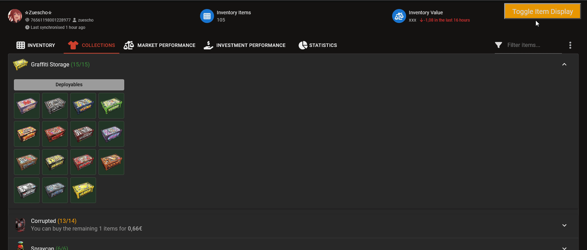
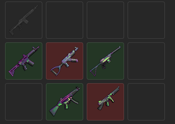
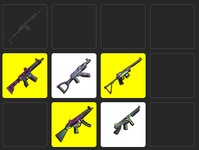

## Adds a button with Tampermonkey that lets you change the highlight color of items in your collection, which is useful if you're colorblind like me.
### Made for the website: [rust.scmm.app](rust.scmm.app)

## Before

## After
Yellow means you own it!

## How to install
First download and install [Tampermonkey](https://www.tampermonkey.net/)

Then import this script, there are many ways to do this one is just open Tampermonkey (the extension) and go to Utilities -> Import from URL and use this [Install Link](https://github.com/Zuescho/RustSCCM-Colorblind/raw/main/SCCM%20for%20red-green%20blinds.user.js)

## Problems
This script isn't great; I'm not experienced in JavaScript. If the button doesn't appear, try reloading the site or toggling the script on and off in Tampermonkey. It should load after that. Also, the script might cause the whole site to lag. I tried to fix this in the latest version, but if your browser keeps freezing, just disable the script after you've looked through your collection.
